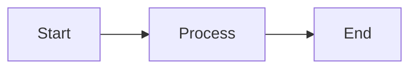

# Solo Slides

A modern, AI-powered presentation system built with [Slidev](https://sli.dev/).

## Features

- **Markdown-first**: Write slides in Markdown with full syntax highlighting, LaTeX, and Mermaid diagrams
- **AI Image Generation**: Generate presentation images using Gemini 2.5 Flash via MCP server
- **Multi-deck Support**: Manage multiple presentations in one repository
- **Slide Reuse**: Share common slides across decks
- **Review Mode**: Get feedback via Utterances (GitHub Issues-based comments)
- **Auto Deploy**: GitHub Pages deployment on push

## Quick Start

```bash
# Install dependencies
make install

# Create a new deck
make new-deck NAME=my-presentation

# Start developing
make dev DECK=my-presentation
```

## Project Structure

```
solo-slides/
├── Makefile              # Build commands
├── decks/                # Your presentations
│   └── sample/           # Example deck
│       ├── slides.md     # Slide content
│       └── public/       # Deck assets (images, etc.)
├── theme/                # Shared theme
│   ├── styles/           # CSS variables and styles
│   ├── layouts/          # Slide layouts
│   └── components/       # Reusable Vue components
├── shared/
│   └── slides/           # Reusable slide snippets
├── mcp-server/           # AI image generation server
└── templates/            # New deck template
```

## Commands

### Development

| Command | Description |
|---------|-------------|
| `make dev DECK=name` | Start dev server for a specific deck |
| `make dev-all` | List available decks |

### Building

| Command | Description |
|---------|-------------|
| `make build DECK=name` | Build a specific deck |
| `make build-all` | Build all decks for deployment |

### Export

| Command | Description |
|---------|-------------|
| `make pdf DECK=name` | Export deck to PDF |
| `make pptx DECK=name` | Export deck to PPTX |

### MCP Server

| Command | Description |
|---------|-------------|
| `make mcp-build` | Build the MCP server |
| `make mcp-dev` | Run MCP server in dev mode |

### Setup

| Command | Description |
|---------|-------------|
| `make install` | Install all dependencies |
| `make new-deck NAME=name` | Scaffold a new deck |

## Writing Slides

### Basic Slide

```markdown
---
theme: ../../theme
title: My Presentation
---

# Slide Title

Content goes here with **Markdown** support.

---

# Next Slide

More content...
```

### Using Layouts

```markdown
---
layout: cover
---

# Title Slide

---
layout: two-cols
---

# Left Column

Content

::right::

# Right Column

More content

---
layout: section
---

# Section Divider
```

### Reusing Shared Slides

```markdown
---
src: ../../shared/slides/intro.md
---

# Your Content

...

---
src: ../../shared/slides/thank-you.md
---
```

### Code Blocks

````markdown
```typescript {1-3|4-6}
// Lines 1-3 highlighted first
const greeting = "Hello";
console.log(greeting);
// Then lines 4-6
const name = "World";
console.log(`${greeting}, ${name}!`);
```
````

### Mermaid Diagrams

````markdown

````

## AI Image Generation

The MCP server integrates with Cursor to generate images using Gemini 2.5 Flash.

### Setup

1. Set your Gemini API key:
   ```bash
   export GEMINI_API_KEY=your_api_key_here
   ```

2. Build the MCP server:
   ```bash
   make mcp-build
   ```

3. Restart Cursor to load the MCP server (configured in `.cursor/mcp.json`)

### Usage in Cursor

Ask Cursor to generate images:

- "Generate a diagram showing microservices architecture for the sample deck"
- "Create a hero image with a futuristic tech theme"
- "List all images in the sample deck"

The MCP server provides three tools:

| Tool | Description |
|------|-------------|
| `generate_slide_image` | Generate an image from a prompt |
| `improve_slide_image` | Modify an existing image |
| `list_deck_images` | List images in a deck |

## Review Mode

Enable commenting by adding `?review=true` to any slide URL:

```
https://your-username.github.io/solo-slides/sample/?review=true
```

### Setup Utterances

1. Install the [Utterances GitHub App](https://github.com/apps/utterances) on your repo
2. Update `theme/components/Comments.vue` with your repo name:
   ```javascript
   const REPO = 'your-username/solo-slides'
   ```

Comments are stored as GitHub Issues, one per slide.

## Deployment

### GitHub Pages (Automatic)

1. Push to the `main` branch
2. GitHub Actions builds all decks
3. Deploys to `https://your-username.github.io/solo-slides/`

### Manual Build

```bash
make build-all
# Output is in dist/
```

## Theme Customization

### Colors

Edit `theme/styles/index.css`:

```css
:root {
  --slidev-theme-primary: #667eea;
  --slidev-theme-accent: #ed64a6;
  /* ... */
}
```

### Layouts

Create custom layouts in `theme/layouts/`:

```vue
<template>
  <div class="slidev-layout my-layout">
    <slot />
  </div>
</template>

<style scoped>
.my-layout {
  /* your styles */
}
</style>
```

### Components

Add reusable components in `theme/components/`. They're automatically available in all slides.

## Tips

- Use `---` to separate slides
- Add speaker notes with `<!-- notes -->` blocks
- Press `p` during presentation for presenter mode
- Press `o` for slide overview
- Use `v-click` for step-by-step reveals

## License

MIT
