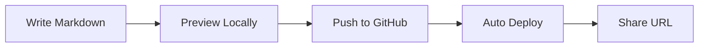

# Solo Slides Demo

A modern presentation system built with Slidev

---
layout: section
---

# Theme Overview

Solo.io branded slide layouts

---
layout: product-header
product: agentregistry
---

# What?

<p class="subtitle">OPEN SOURCE PROJECT + ENTERPRISE PRODUCT</p>

<Card title="Overview">
Unified registry and control plane for AI agents, MCP servers, and skills. Build once, deploy to Kubernetes, GCP Vertex, and AWS AgentCore from a single interface.
</Card>

<div class="grid-2" style="display: grid; grid-template-columns: 1fr 1fr; gap: 1.5rem; margin-top: 1rem;">
  <Card title="Open Source">
    <ul>
      <li><strong>What:</strong> Agent registry for Kubernetes</li>
      <li><strong>How:</strong> CLI for build, push, deploy workflow</li>
      <li><strong>Includes:</strong> K8s deployment & discovery, semantic search, agent scaffolding</li>
    </ul>
  </Card>
  <Card title="Solo Enterprise">
    <ul>
      <li><strong>What:</strong> Multi-cloud control plane for agentic governance</li>
      <li><strong>How:</strong> Cloud account integration + unified dashboard</li>
      <li><strong>Includes:</strong> Vertex/AgentCore deployment & discovery, observability, authorization</li>
    </ul>
  </Card>
</div>

---
layout: two-cols
---

# Markdown First

Write your slides in **Markdown** with full support for:

- Headers and text formatting
- Lists and tables
- Code blocks with syntax highlighting
- LaTeX math equations
- Mermaid diagrams

::right::

# Example Code

```typescript
interface Slide {
  title: string;
  content: string[];
  layout: 'default' | 'cover' | 'section';
}

function createSlide(data: Slide) {
  return { ...data, id: crypto.randomUUID() };
}
```

---

# Mermaid Diagrams



---
layout: roadmap
---

<template #header>

# kagent Roadmap

</template>

<div class="roadmap-card">
  <h3>Production-Grade Governance</h3>
  <ul>
    <li>Advanced access policy (claims, on-behalf-of)</li>
    <li>UI policy builder & visualization</li>
    <li>Policy with agentgateway</li>
    <li>Audit & compliance logging</li>
  </ul>
</div>

<div class="roadmap-card">
  <h3>MCP Ecosystem</h3>
  <ul>
    <li>MCP server registry</li>
    <li>Drift detection & fingerprinting</li>
    <li>Version management</li>
    <li>Declarative configuration</li>
  </ul>
</div>

<div class="roadmap-card">
  <h3>Platform Flexibility</h3>
  <ul>
    <li>Progressive install</li>
    <li>More agent frameworks</li>
    <li>Secret store integrations</li>
    <li>Scale to zero</li>
  </ul>
</div>

<div class="roadmap-card">
  <h3>Intelligent Agent Platform</h3>
  <ul>
    <li>Agent Skills</li>
    <li>Long-term memory</li>
    <li>Evaluations framework</li>
    <li>Agent versioning</li>
  </ul>
</div>

<div class="roadmap-card">
  <h3>Observability</h3>
  <ul>
    <li>Improved metrics, tracing logging</li>
    <li>Cost visibility & tracking</li>
    <li>Advanced audit trails</li>
  </ul>
</div>

<div class="roadmap-card">
  <h3>Provider Agnostic</h3>
  <ul>
    <li>Improved framework support</li>
    <li>Management for other platforms</li>
  </ul>
</div>

---
layout: section
---

# Image Generation

Use AI to create custom visuals

---

# AI-Powered Images

With the MCP server integration, you can ask Cursor to:

- "Generate a diagram showing microservices architecture"
- "Create an icon for API endpoints"
- "Improve the hero image with a more modern look"

Images are automatically saved to your deck's `public/` folder.

---

# Generated Example

This image was generated using the MCP server:


---

# Istio Architecture

Service mesh components and traffic flow:


---

# Review Mode

Add `?review=true` to the URL to enable commenting.

Your reviewers can:
- Leave comments on specific slides
- Use Markdown in comments
- React with GitHub emojis

All feedback is tracked in GitHub Issues.

---
layout: cover
---

# Ready to Build?

```bash
# Create a new deck
make new-deck NAME=my-presentation

# Start developing
make dev DECK=my-presentation

# Export to PDF
make pdf DECK=my-presentation
```

---
src: ../../shared/slides/thank-you.md
---
